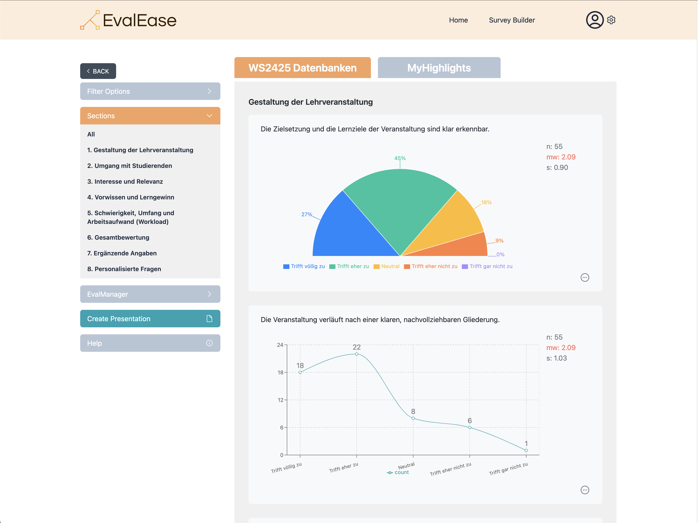
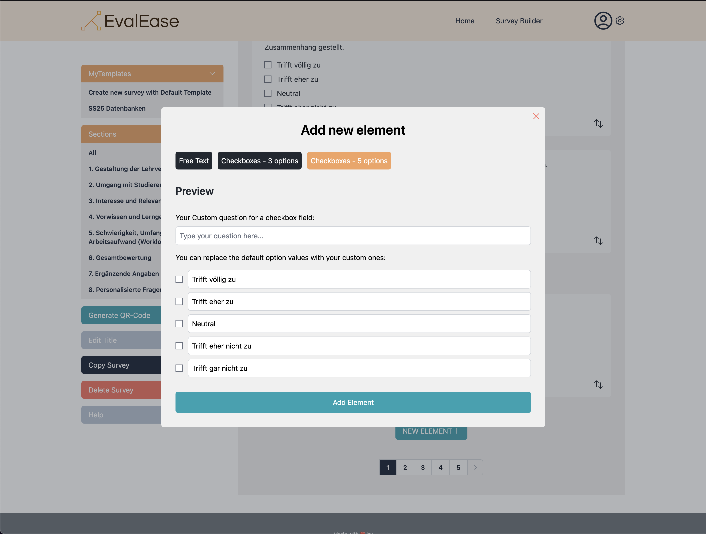
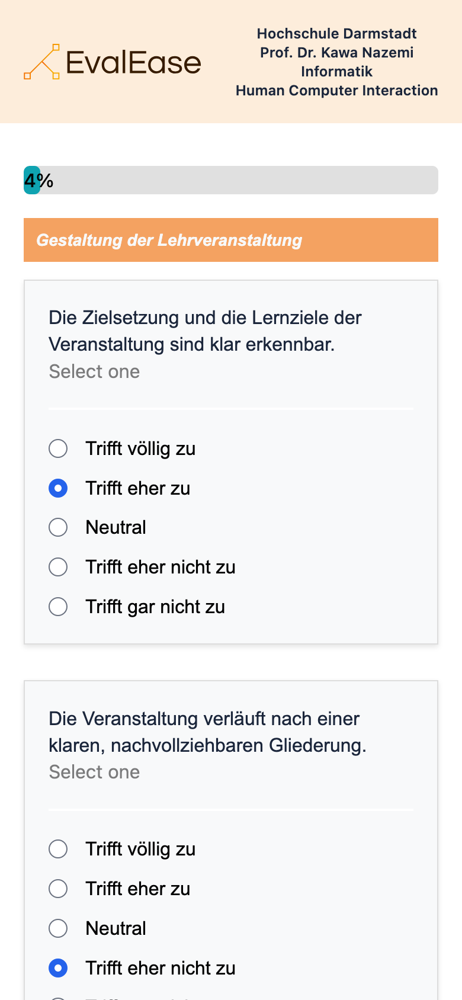
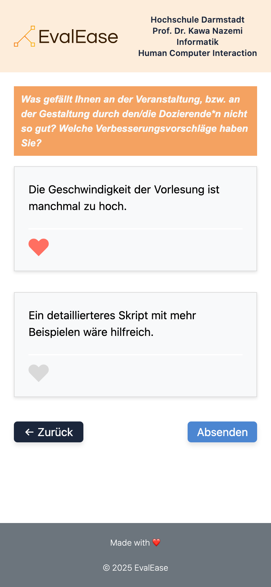

# Evaluation App Documentation

## Overview

The Evaluation App is a full-stack application designed to streamline the process of creating, managing, and analyzing evaluations. Professors can use it to create custom evaluation forms, view past results, and prepare presentations, while students can fill out the forms via mobile devices using QR codes.

<p align="center">
  
  
  
  
</p>

## Tech Stack

This project uses the following technologies:

- **Frontend**:

  - Vite
  - React
  - TypeScript
  - TailwindCSS
  - Recharts, react-wordcloud, heroicons, qrcode

- **Backend**:
  - Express
  - MongoDB with Mongoose

## Project Setup

### Initial Setup

The project was initialized using Vite:

```bash
yarn create vite
```

### Installation

To install dependencies, run:

```bash
yarn install
```

Use Node version **^18.18.0 || ^20.9.0 || >=21.1.0**

### Configure .env Variables

Use mock data:

```bash
MOCK_DB=true
```

Set up MongoDB uri:

```bash
DATABASE_URI_DEV=
DATABASE_URI_PROD=
```

### Development Server

To start the development server:

```bash
yarn dev
```

### Database

Test user login credentials:

```bash
Email: x@x.com
Password: test123
```

Run database seeder when a MongoDB has been set up and the URI set up correctly in .env:

```bash
yarn db-seed
```

### Recommended VSCode Extensions

**Prettier, Eslint** extension -> On Save set to "all"
**Sort Lines** for sorting imports by pressing F9 on marked imports - Seperate sorted import as follows: packages, custom packages, local imports

### Database Setup

Download the GUI and follow the installation instructions for local server for your OS:

- MongoDB GUI https://www.mongodb.com/try/download/compass
- MongoDB local development server https://www.mongodb.com/docs/manual/administration/install-community/
- start service and connect to cluster: mongosh
- copy connection string and create new connection in Compass GUI

## Directory Structure

```plaintext
project-root/
├── server/               # Backend code
│   ├── controllers/      # API controllers
│   ├── database/         # Database connection config, mock data, seeder
│   ├── dtos/             # Data transfer objects
│   ├── middlewares/      # Express API middlewares
│   ├── models/           # Mongoose models
│   ├── routes/           # API routes
│   ├── services/         # API services
│   └── app.ts            # Server entry point
├── src/frontend/app      # Source code for frontend
│       ├── assets/       # Images, SVG etc.
│       ├── components/   # Reusable React components
│       ├── context/      # Context for state management
│       ├── hooks/        # Reusable React hooks for state management, api requests etc.
│       ├── pages/        # Page components
│       ├── public/       # Static assets
│       ├── utils/        # Helper files functions, interfaces etc.
│       ├── styles/       # Custom styles
│       ├── App.tsx       # Main application component
│   └── main.tsx          # React entry point
├── docs/                 # Various setup readme
├── .env                  # Environment variables
├── package.json          # Project metadata and dependencies
├── README.md             # Project documentation
└── ...various configuration files
```

## Features

1. **Professor Panel**:

- Login/authentication for profile management.
- Create evaluations with custom questions.
- View and manage past evaluations.
- Export results for presentations.

2. **Student Access**:

- Fill evaluation forms shared via QR codes.

3. **Database**:

- MongoDB for persistent data storage (currently using a local setup; server-hosted migration planned).

## Future Enhancements

- Download evaluation results as a file
- Compare two evaluations

## License

This project is licensed under the MIT License.

## Release Versions

### v0.1 initial project configuration (Nui Ruppert), 14.01.25

- Tech stack research and implementation
- Configure mono repository setup and ensure compatibility with Vite:
  - Directory structure (frontend, backend)
  - package.json scripts
  - Environment variables
  - Typescript, TailwindCSS, Vite frontend/backend configuration
  - Project layout (Header, Footer, Main, Login, Profile, Logout)
  - React router with protected and public routes
  - Setup API (Express controller/services) endpoints for database/mock data requests
  - Setup JWT authentication (login, logout)
  - Prepare database connection and mock data for local development
  - Login and Profile views with authentication flow

### v0.2 add content layout components (Nui Ruppert), 19.01.25

- Configurable Base layout for logged in view
  - Actions component (left column content)
  - Evaluations component with tabs (right column content)
  - Modal wrapper
  - Home page history/favorites and actions (search, favorite filter, sorting)

### v0.3 add Survey and Evaluation views for student (Edwin Schweigert), 22.01.25

- Layout for student mobile view
- initial Survey view for student
- initial Evaluation Presentation view for student

### v0.4 add Evaluation Details view, prepare create Presentation and Survey Builder views (Nui Ruppert), 23.01.25

- Update routes, mock data, API endpoints for Evaluation details
- Add backup data

- Evaluation Details view
  - Charts components (scale, pie) for Recharts package
- Create Presentation view
  - layout and actions (view only for demonstration purposes)
- Survey Builder view
  - layout and actions (view only for demonstration purposes)
- 404 Page and fallbacks for fetch errors

### v0.5 add Chart Components, Pagination, various filter options, QR-Code generator (Nui Ruppert, Daniel Hecht), 29.01.25

- **_recharts, stopword, react-wordcloud_**: add Line Chart, Free Text and WordCloud components
- add Back Button for navigation
- **_qrcode_**: add QR-Code modal for generate URL and QR-Code with download
- add filter options to Evaluation page (display types, catefories, tabs, pages)
- add pagination
- match JWT expiry time to the cookie

### v0.6 update Create Presentation page actions and add show/hide feature to result component (Nui Ruppert, Daniel Hecht), 30.01.25

- Presentation Page

  - Eval Manager actions (download, reset/show all)
  - Filter categories
  - second tab for hidden questions
  - update all result components with hide/show feature
  - prepare API endpoint for update all question results

- Evaluation Page
  - add filter option for word cloud components

### v0.7 create Survey Builder components, add api for survey creation (Nui Ruppert, Daniel Hecht), 30.01.25

- Survey database
- Default questions
- Survey Api
- Survey page actions
- Question components

### v0.8 add advanced features to Survey Builder (Edwin Schweigert, Nui Ruppert), 01.02.25

- add API and component to delete survey
- add API and component to copy complete survey (requested feature from feedback)
- add API and component to delete custem survey questions
- add new element modal form view (add free text and various checkbox types)
- **_@hello-pangea/dnd_**: drag and drop feature for all survey questions within their categories
- edit Survey title modal, hooks and refactoring

### v0.9 connect Evaluation Result and Survey student view with database (Edwin Schweigert, Daniel Hecht), 02.02.25

- connect student survey view with database, display created survey
- connect student result view for open questions with database, display open questions with "like" feature
- refactor student view components to match database structure

### v1.0 add requested features from Testing phase (Edwin Schweigert, Daniel Hecht, Nui Ruppert), 05.02.25

- add statistics to chart components (requested feature)
- add tooltips with small toturial/information for each page (requested feature)
- update readme
- cleanup and style fixes
